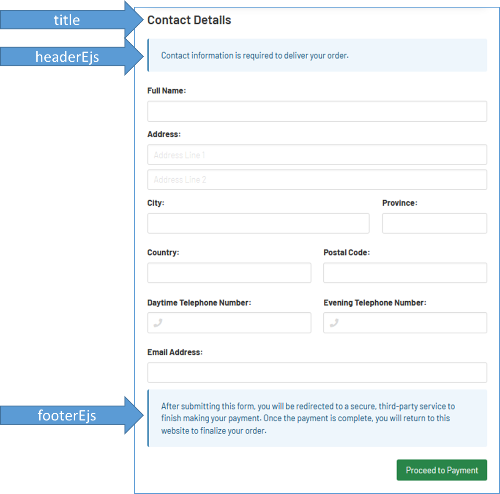

# config.js

The `data/config.js` file is used to customize your application.
On first install, the file does not exist.  You must create one.

```javascript
let config = {};

// your configuration

module.exports = config;
```

* * *

## `config.application = {};`

| Property Name     | Type   | Description                                         | Default Value       |
| ----------------- | ------ | --------------------------------------------------- | ------------------- |
| `applicationName` | string | Make the application your own by changing the name. | `"Mini Shop"`       |
| `httpPort`        | number | The listening port for HTTP.                        | `7777`              |
| `https`           | object | The HTTPS configuration.                            | _(Described below)_ |

### `config.application.https = {};`

| Property Name | Type   | Description                                | Default Value |
| ------------- | ------ | ------------------------------------------ | ------------- |
| `port`        | number | The listening port for HTTPS.              | `null`        |
| `keyPath`     | string | The path to the key file.                  | `null`        |
| `certPath`    | string | The path to the certificate file.          | `null`        |
| `passphrase`  | string | The secret passphrase for the certificate. | `null`        |

## `config.reverseProxy = {};`

The settings here are most useful in cases where
the Node application will be served from a subfolder,
and use another server like IIS as a reverse proxy.

| Property Name           | Type    | Description                                                                                             | Default Value |
| ----------------------- | ------- | ------------------------------------------------------------------------------------------------------- | ------------- |
| `disableCompression`    | boolean | Whether the Node server should avoid compressing responses.                                             | `false`       |
| `disableEtag`           | boolean | Whether the Node server should send an etag header.                                                     | `false`       |
| `blockViaXForwardedFor` | boolean | Whether the Node server should enforce IP abuse filters by the IP address in the X-Forwarded-By header. | `false`       |
| `urlPrefix`             | string  | The folder name to prefix all URLs with.                                                                | `""`          |

## `config.orderNumberFunction = () => string;`

A function used to generate a new order number.

```javascript
// Default function
() => {
  return "RCT-" + uuidv4().toUpperCase();
});
```

## `config.site.header = {};`

| Property Name          | Type   | Description                                                                                                                    | Default Value |
| ---------------------- | ------ | ------------------------------------------------------------------------------------------------------------------------------ | ------------- |
| `backgroundColorClass` | string | The color-piece of the [Bulma background color class](https://bulma.io/documentation/helpers/color-helpers/#background-color). | `"info"`      |
| `logoImagePath`        | string | The path to image that should be included in the site header.  Small images recommended!                                       | `""`          |

## `config.site.footer = {};`

| Property Name          | Type    | Description                                                                                                                    | Default Value       |
| ---------------------- | ------- | ------------------------------------------------------------------------------------------------------------------------------ | ------------------- |
| `isVisible`            | boolean | Whether or not the footer should be shown.                                                                                     | `true`              |
| `backgroundColorClass` | string  | The color-piece of the [Bulma background color class](https://bulma.io/documentation/helpers/color-helpers/#background-color). | `"dark"`            |
| `textColorClass`       | string  | The color-piece of the [Bulma text color class](https://bulma.io/documentation/helpers/color-helpers/#text-color).             | `"light"`           |
| `footerEjs`            | string  | The name of the EJS file that should be displayed at the footer.                                                               | `"site_thanks.ejs"` |

## `config.views = {};`

| Property Name       | Type                               | Description                                                 |
| ------------------- | ---------------------------------- | ----------------------------------------------------------- |
| `products`          | ViewDefinition _(described below)_ | Customizations for the store home page.                     |
| `checkout`          | ViewDefinition _(described below)_ | Customizations for the top section of the checkout page.    |
| `checkout_shipping` | ViewDefinition _(described below)_ | Customizations for the bottom section of the checkout page. |
| `toPayment`         | ViewDefinition _(described below)_ | Customizations for the page that redirects to payment.      |
| `order`             | ViewDefinition _(described below)_ | Customizations for the final order page.                    |

### ViewDefinition



| Property Name | Type   | Description                                                      |
| ------------- | ------ | ---------------------------------------------------------------- |
| `title`       | string | The page or section title.                                       |
| `headerEjs`   | string | The name of the EJS file that should be displayed at the top.    |
| `footerEjs`   | string | The name of the EJS file that should be displayed at the bottom. |

## `config.productCategories = {}[];`

| Property Name  | Type      | Description                                                           |
| -------------- | --------- | --------------------------------------------------------------------- |
| `categoryName` | string    | The name of the product category.                                     |
| `categoryEjs`  | string    | The name  of the EJS file that should appear before the product list. |
| `productSKUs`  | string\[] | A list of productSKUs for the products included in the category.      |

## `config.products = { [productSKU: string]: {} };`

| Property Name          | Type               | Description                                                                                                                     |
| ---------------------- | ------------------ | ------------------------------------------------------------------------------------------------------------------------------- |
| `productName`          | string             | The name of the product.                                                                                                        |
| `description`          | string             | The brief description of the product.                                                                                           |
| `image.path`           | string             | The URL path of a sample image.                                                                                                 |
| `image.dimensionClass` | string             | The ratio-piece of the [Bulma image ratio class](https://bulma.io/documentation/elements/image/#responsive-images-with-ratios). |
| `price`                | number or "form"   | The price of the product, or the string "form" if the price can vary and should be handled by a field in the projectEjs file.   |
| `formFieldsToSave`     | FieldDefinition\[] | The form fields included in the projectEjs file that should be saved along with the item record.                                |
| `fees`                 | string\[]          | A list of feeSKUs.                                                                                                              |
| `projectEjs`           | string\[]          | The name of the EJS file that includes product information and any additional fields required for order processing.             |

### FieldDefinition

| Property Name   | Type   | Description                              |
| --------------- | ------ | ---------------------------------------- |
| `fieldName`     | string | The human-readable name of the field.    |
| `formFieldName` | string | The name attribute for the HTML element. |

## `config.fees = { [feeSKU: string]: {} };`

| Property Name    | Type                | Description                             |
| ---------------- | ------------------- | --------------------------------------- |
| `feeName`        | string              | The human-readable name of the fee.     |
| `feeCalculation` | (Product) => number | The function used to calculate the fee. |

## `config.currency = {};`

| Property Name  | Type   | Description                            | Default Value        |
| -------------- | ------ | -------------------------------------- | -------------------- |
| `code`         | string | The short code for the store currency. | `"CAD"`              |
| `currencyName` | string | The long name for the store currency.  | `"Canadian Dollars"` |

## `config.store = {};`

[See the Store Documentation](stores.md)
